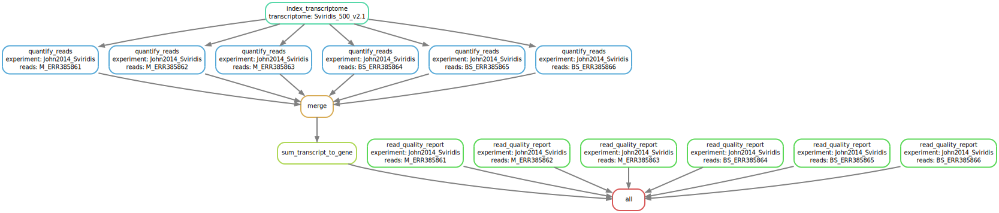

# RNA_seq_read_quantification_pipeline

Snakemake pipeline for quantifying RNA-seq reads against a transcriptome, with mean calculation for each condition.

#### To run pipeline:
- Place transcriptome file ```<transcriptome>_transcript.fa``` in ```data/transcriptomes/```
- Place paired read files ```<experiment>_<reads>_1.fastq``` and ```<experiment>_<reads>_2.fastq``` in ```data/reads/```
- Activate a conda environment with snakemake installed
- Run the following command:
```
snakemake -s RNA_seq_read_quantification_snakefile.smk --cores 10 --use-conda
```
#### Output:
- Read quality reports in: ```fastqc/<experiment>_<reads>/```
- Transcript-level quantification file in: ```data/quants/<experiment>_total_transcript_quant.txt```
- Gene-level quantification file in: ```data/quants/<experiment>_total_gene_quant.txt```


#### Pipeline:


